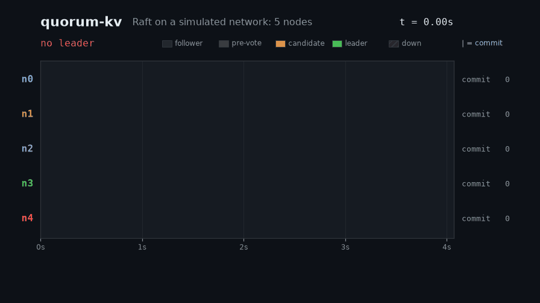
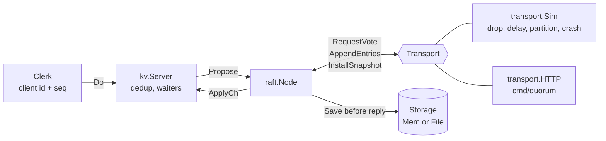

# quorum-kv

A Raft consensus implementation in Go and the linearizable key-value store built on it, tested by injecting message loss, partitions and crashes and then checking the recorded history with a linearizability checker.

[](https://github.com/armaghanrashid/quorum-kv/actions/workflows/ci.yml)



*One run of `go run ./cmd/demo`, drawn from its own event log. A static copy of the whole run is in [`docs/media/timeline.png`](docs/media/timeline.png).*

## Why it's interesting

- **Raft from the paper, with the parts that bite.** Election with PreVote, fast log backtracking, no-op on election, current-term-only commit counting, durable term/vote/log with persist-before-reply, snapshots with `InstallSnapshot`. Standard library only.
- **Tested against a hostile network, not a friendly one.** A seeded simulator drops 20% of messages, partitions and heals the cluster, and crashes and restarts nodes while clients keep writing. Properties are asserted continuously: one leader per term, identical applied logs, no committed entry lost.
- **Linearizability is checked, not assumed.** Every client operation is recorded with wall-clock call and return times and handed to [porcupine](https://github.com/anishathalye/porcupine). I broke the store on purpose (served reads locally, removed dedup, stopped persisting votes, stopped truncating conflicting entries) and confirmed the tests fail each time.

## Architecture



| Path | Role |
| --- | --- |
| `raft/` | The protocol: `election.go`, `replication.go`, `snapshot.go`, `log.go`, `persist.go`, `rpc.go` |
| `kv/` | Replicated state machine (`Get`/`Put`/`Append`), per-client dedup, `Clerk`, HTTP front end |
| `transport/` | `Sim` (fault-injecting in-process network) and `HTTP` |
| `internal/cluster/` | Test and demo harness: N nodes, crash/restart, election-safety recorder |
| `cmd/quorum/` | One real node over HTTP with on-disk state |
| `cmd/demo/` | The scripted scenario above |
| `tools/render.py` | Turns the demo's CSV into `docs/media/` |

## Quickstart

Requires Go 1.25 or newer.

```sh
git clone https://github.com/armaghanrashid/quorum-kv && cd quorum-kv
go run ./cmd/demo                 # coloured timeline; add --no-color to disable
go test -race ./...               # the whole suite, about 25 s
```

A real three-process cluster on localhost:

```sh
P=localhost:7000,localhost:7001,localhost:7002
for i in 0 1 2; do go run ./cmd/quorum --id $i --data /tmp/quorum-$i --peers $P & done
sleep 2; curl localhost:7000/status          # which node is the leader?
curl -X PUT localhost:7002/kv/greeting -d hello   # send writes to the leader; others answer 503 + X-Leader-Hint
curl localhost:7002/kv/greeting
```

Regenerate the media (needs Python 3.12 and ffmpeg):

```sh
go run ./cmd/demo --csv events.csv > /dev/null
python3.12 -m venv tools/.venv && tools/.venv/bin/pip install -r tools/requirements.txt
tools/.venv/bin/python tools/render.py events.csv --out docs/media
```

## Results

One run of `go test -race -count=1 ./...` on an 8-core laptop (Go 1.27.2):

```
ok  github.com/armaghanrashid/quorum-kv/kv         19.0s
ok  github.com/armaghanrashid/quorum-kv/raft       22.4s
ok  github.com/armaghanrashid/quorum-kv/transport   1.5s
```

44 passing tests and subtests, 0 failures, 23 s wall clock. The linearizability test, per seed (5 clients, 5 nodes, 20% message drop, random partitions and crashes, 5 s of faults):

| Seed | Operations checked | Gets | Partitions | Crashes | Leader terms | Messages lost / sent |
| --- | --- | --- | --- | --- | --- | --- |
| 1 | 943 | 380 | 3 | 2 | 3 | 1663 / 5735 |
| 2 | 728 | 271 | 8 | 0 | 6 | 1932 / 5062 |
| 3 | 1333 | 528 | 3 | 1 | 2 | 1872 / 7520 |

All three histories are linearizable. Operation counts vary a little from run to run because goroutine scheduling is not seeded; see Testing.

## Testing

| Property | Test |
| --- | --- |
| Initial election, stable leadership | `TestInitialElection` |
| Re-election after leader crash, old leader rejoins | `TestReElectionAfterLeaderCrash` |
| At most one leader per term under partitions | `TestNoSplitBrainUnderRandomPartitions` (3 seeds), `TestChaos` (3 seeds) |
| Minority leader cannot commit | `TestMinorityLeaderCannotCommit` |
| Logs agree after heal; deposed leader's entries never applied | `TestLogAgreementAfterHeal` |
| State survives restart (full power cycle, rolling restarts) | `TestPersistenceAcrossFullRestart`, `TestPersistenceRollingRestarts` |
| A vote is never granted twice or granted unpersisted | `TestVoteSurvivesRestart`, `TestVoteNotGrantedWhenPersistFails` |
| Election restriction | `TestStaleAndUpToDateVoteRules` |
| PreVote stops term inflation (and its absence does not) | `TestPreVoteIsolatedNodeDoesNotDisrupt`, `TestWithoutPreVoteIsolatedNodeInflatesTerm` |
| Snapshot install on a lagging follower; restart from snapshot | `TestSnapshotInstallOnLaggingFollower`, `TestRestartFromSnapshot` |
| Exactly-once under retries | `TestRetriesAreExactlyOnce` |
| KV linearizable under 20% drop, partitions, crashes (3 seeds) | `TestLinearizabilityUnderFaults` |
| The checker rejects a stale read | `TestCheckerRejectsStaleRead` |
| Real sockets and on-disk storage | `TestHTTPClusterWithFileStorage` |

`go vet ./...` and `gofmt` are clean, and CI runs `go vet` and `go test -race ./...`.

Randomness is seeded (network faults, partition schedule, election timers, workload), but the Go scheduler is not, so a seed reproduces the fault *rates and schedule*, not an exact interleaving. That is why tests assert properties (never "node 3 wins at 212 ms") and why a failure is found by running many schedules rather than replaying one. Timeouts are real wall-clock time, a few hundred milliseconds, so the code under test is the production code, not a virtual-clock variant.

## Design decisions and trade-offs

**Election timeouts.** Randomised in [150, 300) ms with a 30 ms heartbeat, a 5 to 10 ratio, so a follower misses several heartbeats before suspecting the leader. The randomness is drawn from a per-node seeded generator; a restarted node gets a new seed so it does not replay the same sequence. Each leader's replicator goroutine owns its own heartbeat clock, so a slow follower delays only itself.

**PreVote is implemented.** Without it, a node cut off from the group times out repeatedly and increments its term each time; on rejoining, its inflated term forces a healthy leader to step down for nothing. With PreVote a timed-out node first asks "would you vote for me at term+1?" and only starts a real election if a quorum says yes. Peers say no if they are the leader or heard from a leader within the minimum election timeout, and PreVote requests change no durable state on either side. `TestPreVoteIsolatedNodeDoesNotDisrupt` shows the isolated node's term stays put for 1.5 s and the leader is undisturbed on heal; the control test turns PreVote off and shows the term running away. The cost is one extra round trip on every election. I did not implement CheckQuorum, so a leader cut off from the majority keeps believing it leads until it hears a higher term. That is safe here because every read goes through the log and cannot commit, but a production system would add it so clients fail over faster.

**Persistence ordering.** Term, vote and log are written to `Storage` while holding the node lock, before the node replies to or sends any message that depends on them: a granted vote, an acknowledged `AppendEntries`, a candidate's own term bump. Reply-after-persist is what lets a node forget everything volatile in a crash and still honour every promise it made. If `Save` fails, the node halts rather than continue promising things it might forget (`TestVoteNotGrantedWhenPersistFails`). `FileStorage` writes a temp file, fsyncs it, renames it over the old state and fsyncs the directory, with a CRC so corruption is detected on load. It rewrites the whole state on each save, which is O(log length) per write; snapshots bound the log, so it stays cheap, but a production system would append to a write-ahead log and fsync once per batch.

**Commit rule and the no-op.** A leader only counts replicas to commit entries from its own term (paper section 5.4.2); earlier entries commit indirectly. A new leader therefore appends an empty entry, so it can commit its inherited log without waiting for a client. `ApplyCh` delivers that entry marked `Noop`.

**Log backtracking.** A rejected `AppendEntries` carries the conflicting term and where it starts, so a leader skips a whole term per round trip instead of one entry. Followers never truncate unless an existing entry conflicts, so stale or reordered RPCs cannot erase acknowledged entries, and a follower panics if asked to overwrite a committed entry, which would mean a bug elsewhere.

**Snapshots.** The application calls `Snapshot(index, data)` once it has applied through `index`; the node compacts its log and persists the snapshot with it. A follower whose `nextIndex` falls behind the compaction point receives `InstallSnapshot`. Simplification: the snapshot goes in a single message, with no chunking or offset, which is fine for a store that fits in memory and would not be for a large one.

**Reads go through the log.** `Get` is an ordinary log entry. A leader answering from memory could be a deposed leader that has not noticed yet and would serve stale data. This costs a log round trip per read; leader leases or ReadIndex would trade that for clock or heartbeat assumptions.

**Exactly-once.** A client has one outstanding request and numbers it; servers keep the highest sequence number per client plus the result of its last `Get`. A retry after a lost reply or a failover is therefore answered from the session table and never executed twice, and the sessions travel inside snapshots.

**How linearizability is checked.** Each client records, for every operation, the wall-clock time before its first attempt and after the last attempt succeeds, so retries only widen the interval. The history goes to porcupine's `CheckOperations` with a model of one string register per key (`Put` overwrites, `Append` concatenates, `Get` must return the current value), partitioned by key because keys do not interact. porcupine searches for any total order consistent with every real-time bound and the register semantics; if none exists the history is rejected. Two details make the test meaningful. Clients have no leader affinity: each operation starts at a random replica, so a replica that answered without consensus would be caught. And `TestCheckerRejectsStaleRead` shows the model rejects a stale read. Mutations I ran by hand against the unchanged tests, each of which failed them: serving `Get` from local state (non-linearizable on all three seeds), removing session dedup, not persisting the vote, and not truncating conflicting log entries.

**Fault injection model.** `transport.Sim` evaluates partitions and crashes at delivery time, after the delay, so a fault that begins while a message is in flight kills it. Request and reply are dropped independently, so a call can fail after the remote side already acted, which is the case that makes retries and dedup necessary. A crash stops the node object; only its `Storage` survives.

**Not done.** Membership changes, chunked snapshots, a write-ahead log, CheckQuorum, batching and pipelining beyond one in-flight RPC per follower, and TLS or auth on the HTTP transport.

## Licence

Copyright (c) 2026 Muhammad Armaghan Rashid. All rights reserved. Published for viewing only; no licence to use, copy, modify or distribute is granted. See [LICENSE](LICENSE).
